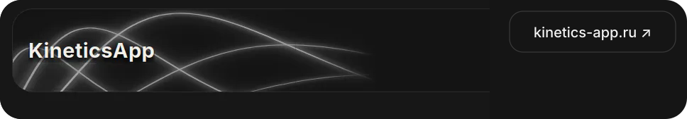

# Savateykin Yaroslav

**Chemistry · Scientific Computing · Developer Tools**

Building scientific software for chemistry and small tools that make technical work less painful.

 

## Featured projects

 

 

 

## Tools

<table><tr><td width="50%" valign="top">

### `unc_tools`
Utilities for uncertainty-aware regression, symbolic helpers, and scientific plotting.

[**Repository ↗**](https://github.com/yaroslavsavateykin/unc_tools)

</td><td width="50%" valign="top">

### `omd2tex`
Markdown → LaTeX converter built around Obsidian technical-writing workflows.

[**Repository ↗**](https://github.com/yaroslavsavateykin/omd2tex)

</td></tr></table>

 

`Python` · `Rust` · `TypeScript` · `WebAssembly` · `PostgreSQL` · `Docker`

